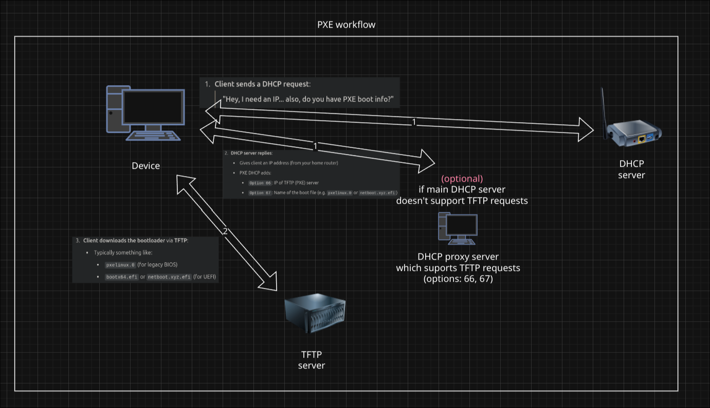
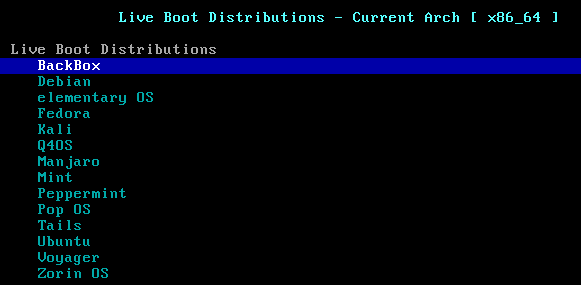

# Netboot.xyz setup with `dnsmasq`

In this step, we focus on using netboot.xyz, which is a powerful tool for interactive OS installation over the network.
We intentionally chose to set everything up manually with dnsmasq, pxelinux, and netboot.xyz to get hands-on experience and better understand how PXE booting works under the hood.**

In the next step, we’ll make things a bit different — instead of manually configuring pxelinux, we’ll use the official **Ubuntu Server netboot** image and provide an autoinstall file to automate the entire OS installation process across our nodes.

**👉 If you're not interested in exploring netboot.xyz, you can skip the "Prepare the TFTP Root Directory" section below. The upcoming step will use a preconfigured Ubuntu netboot image, which simplifies the process.**

## 🔐 PXE Boot Security Note

PXE boot is **not secure on untrusted networks**. It uses:

- Unauthenticated DHCP (any device can respond)
- Unencrypted TFTP (no identity or integrity checks)
- No file verification (especially in BIOS setups)

> **Avoid enabling PXE boot on shared or public networks without strict controls**

## 🧠 What is PXE?

**PXE (Preboot Execution Environment)** is a standard that allows computers to boot an operating system via the network, before any OS is installed on the disk. PXE is especially useful for:

- Quickly provisioning many machines

- Avoiding the need for USB sticks or physical access

- Automating operating system installation with tools like Preseed and cloud-init

## ❓ Why `dnsmasq`?

Many consumer routers **cannot serve TFTP**, and most cannot customize PXE bootloader responses. In our setup, we still use the router’s built-in DHCP server to assign IP addresses, but we run `dnsmasq` as a **proxy DHCP (PXE-specific responder)** that only replies with:

- The TFTP server IP address

- The bootloader filename to download

We point PXE clients to `dnsmasq` itself for the TFTP server, because it includes a lightweight built-in TFTP service. This makes it simple to serve bootloader files like `pxelinux.0` from the same place.

## PXE Boot Workflow

Here’s how PXE boot works in our setup:

1. Node powers on with PXE enabled in BIOS
2. Node sends a DHCP broadcast to request an IP
3. Separate DHCP server responds with an IP address
4. dnsmasq (our PXE server) responds with an IP of a TFTP server
5. Node downloads bootloader (e.g., netboot.xyz)
6. Node boots into installer or live environment



In our setup **DHCP proxy server** and **TFTP server** are the same machines.

## ⚙️ Setting Up dnsmasq PXE Server

### 1. Enable PXE Boot on Target Devices

If you decided to follow this tutorial on real machines, the first step is to check whether PXE boot is enabled in the BIOS of each device. PXE boot is often referred to as **"Network Boot"** or **"Boot from LAN"** and older machines may have this setting hidden or disabled by default.

1. Reboot the machine and enter BIOS/UEFI setup (usually by pressing `Del`, `F2`, or `F12` during startup).

2. Look for settings under the **Boot**, **Advanced**, or **LAN sections**.

3. Enable options such as PXE Boot, Network Boot, or Boot from LAN.

4. Optionally, move Network Boot higher in the boot priority list.

Once enabled, save and exit the BIOS settings.

⚠️ While it’s possible to set up PXE server (dnsmasq + TFTP) in an isolated container (**LXD**, **Docker**) or **VM**, for simplicity and reliability we recommend running it directly on a bare-metal host or bridged VM where you can control the network interface easily.

### 2. Install required packages

``` bash
sudo apt update
sudo apt install dnsmasq wget syslinux-common -y
```

### 3. Prepare the TFTP Root Directory

In this step, we’ll populate the TFTP directory with the required files for PXE boot.

The key files are:

- `pxelinux.0` – The PXE bootloader from the SYSLINUX project. It’s the first file the PXE client downloads and executes. It handles showing a menu and loading the kernel.

- `ldlinux.c32` – A required module that provides runtime support for pxelinux.0. It must be in the same directory.

- `netboot.xyz.lkrn` – A self-contained kernel provided by netboot.xyz that allows users to select and install various OSes over the network.

- `pxelinux.cfg/` – A directory where configuration files are stored. PXE clients will look here for their boot config. At minimum, a default file is needed.

#### 1. Create root and config directories for tftp

``` bash
mkdir -p /srv/tftp /srv/tftp/pxelinux.cfg
```

#### 2. Copy `pxelinux.0`, `ldlinux.c32` and download `netboot.xyz.lkrn` files

``` bash
# PXE bootloader (BIOS)
cp /usr/lib/PXELINUX/pxelinux.0 /srv/tftp
cp /usr/lib/syslinux/modules/bios/ldlinux.c32 /srv/tftp

# Download netboot.xyz (BIOS kernel)
wget -O /srv/tftp/netboot.xyz.lkrn https://boot.netboot.xyz/ipxe/netboot.xyz.lkrn
```

#### 3. Create PXE menu and save it to `/srv/tftp/pxelinux.cfg/default`

``` bash
cat <<EOF | sudo tee /srv/tftp/pxelinux.cfg/default > /dev/null
DEFAULT netboot

LABEL netboot
   MENU LABEL Boot netboot.xyz
   KERNEL netboot.xyz.lkrn
EOF
```

This menu tells `pxelinux.0` to:

- Use the label `netboot` by default
- Display the option **Boot netboot.xyz**
- Load the `netboot.xyz.lkrn` kernel file when selected

### 3. Configure dnsmasq

Create a separate PXE-specific config, e.g. `/etc/dnsmasq.d/pxe.conf` and write to it:

``` bash
# Disable built-in DNS
port=0

# Listen only on PXE server interface
interface="<INTERFACE_NAME>"
bind-interfaces

# Enable PXE proxy-DHCP mode
dhcp-range=<IP_SUBNET>,proxy

# PXE bootloader (for BIOS clients)
dhcp-boot=pxelinux.0

# Enable TFTP
enable-tftp
tftp-root=/srv/tftp

# Optional menu label
pxe-service=x86PC, "Boot from LAN (BIOS)", pxelinux.0

# Logging
log-dhcp
log-queries
```

- Replace `<INTERFACE_NAME>` with your real interface name such as `eth0`, `wlp2s0` etc. (you could check it using `ip a` command)

- Replace `<IP_SUBNET>` with your real ip subnet. For example, if your interface is `192.168.0.x/24`, use `dhcp-range=192.168.0.0,proxy`.

After saving config file, restart `dnsmasq` service

``` bash
sudo systemctl restart dnsmasq
```

## 🧪 Test it

1. Make sure PXE is enabled in the BIOS of your client device.

2. Connect the client and PXE server to the same LAN.

3. Boot the client – it should get an IP and download `pxelinux.0` and `netboot.xyz.lkrn`

4. You should see the netboot.xyz menu



## 🔁 Next Steps

Once **PXE** is working, we’ll move on to:

- Automating Ubuntu server installations with **Autoinstall**

- Configuring nodes using **cloud-init**

- Using **Ansible** to provision software and workloads

### ➡️ Continue to: Automated Ubuntu Server Installation

## References

- <https://wiki.archlinux.org/title/Syslinux#PXELINUX>
- <https://wiki.archlinux.org/title/Preboot_Execution_Environment>
- <https://netboot.xyz/docs>
