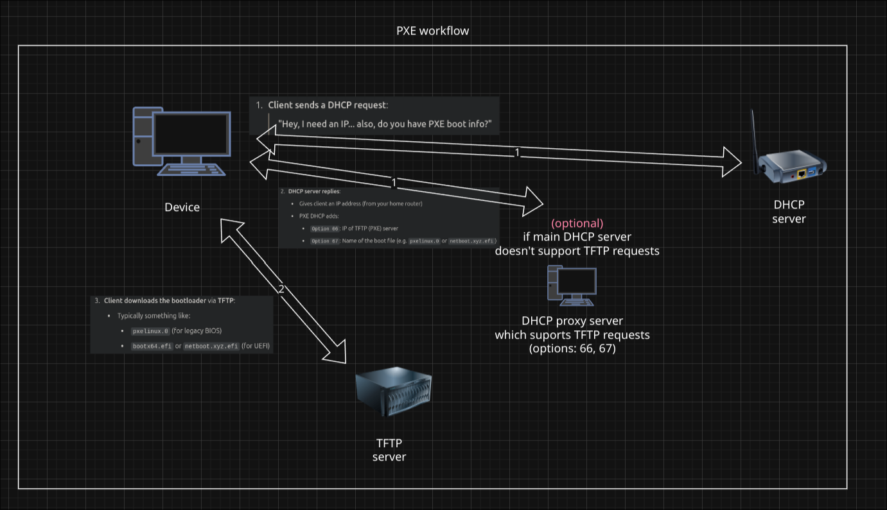

# Documentation for Cluster Project

## Setup

To automate node creation (OS installation and initialization) we use PXE (netboot.xyz) combined with cloud-init and Preeseed.



### 1. Enable PXE in BIOS of nodes

napisac tutaj ze kazdy komp w biosie jakos inaczej musi to wlaczyc


### 2. Setup PXE server

```bash
lxc
```
